# 📌 Houbara Detection using YOLOv10 + MobileSAM

This repository contains an advanced **real-time wildlife detection** pipeline using **YOLOv10** for object detection and **MobileSAM** for instance segmentation. The system is optimized for speed and efficiency, making it suitable for **wildlife monitoring, ecological research, and conservation applications**.

---

## 🚀 Features
✅ Uses **YOLOv10** for real-time Houbara Bustard detection  
✅ Integrates **MobileSAM** for segmentation  
✅ Implements **multi-threading** for speed optimization  
✅ Processes **images and videos** automatically  
✅ Saves **segmented outputs & bounding boxes**  
✅ Includes **video compression for storage efficiency**  

---

## 📂 Repository Structure
```
Houbara-Detection/
│── models/                     # Store pre-trained models
│   ├── best_yolo10_40k.pt      # YOLO model
│   ├── mobile_sam.pt           # MobileSAM model
│
│── input_videos/                # Input videos (Optional)
│── output/                      # YOLO + SAM results
│
│── scripts/                     # Python scripts
│   ├── detect.py                # Main YOLO + SAM script
│   ├── preprocess.py            # Pre-processing functions
│   ├── compress_videos.py       # Video compression
│   ├── download_models.py       # Script to download models from Google Drive
│
│── requirements.txt              # Dependencies
│── README.md                     # Documentation
│── setup.sh                      # Easy install script (Linux/macOS)
│── setup.bat                     # Easy install script (Windows)
│── .gitignore                    # Ignore large files
```

---

## 🛠 Installation
### 🔹 1️⃣ Clone the Repository
```bash
git clone https://github.com/yourusername/Houbara-Detection.git
cd Houbara-Detection
```

### 🔹 2️⃣ Install Dependencies
```bash
pip install -r requirements.txt
```

### 🔹 3️⃣ Download Pre-Trained Models
Since **GitHub does not support large files**, download models manually:

#### 📥 **Manual Download**
- **[Download YOLOv10 Model](https://drive.google.com/your_yolo_model_link)**  
- **[Download MobileSAM Model](https://drive.google.com/your_sam_model_link)**  
- Place them in the **`models/`** folder.

#### 📥 **Auto-Download Using Python**
Alternatively, run:
```bash
python scripts/download_models.py
```

---

## 🎯 Running the Pipeline

### 📌 **1️⃣ Run on an Image Folder**
```bash
python scripts/detect.py --input input_images/ --output output/
```

### 📌 **2️⃣ Run on a Video**
```bash
python scripts/detect.py --input input_videos/sample.mp4 --output output/
```

### 📌 **3️⃣ Compress Videos**
```bash
python scripts/compress_videos.py --input output/video.mp4 --output output/compressed.mp4
```

---

## 🎬 Demo Results
### **YOLO Detection + SAM Segmentation**
| Input | SAM | YOLO-SAM |
|--------|------------|-------------|
| 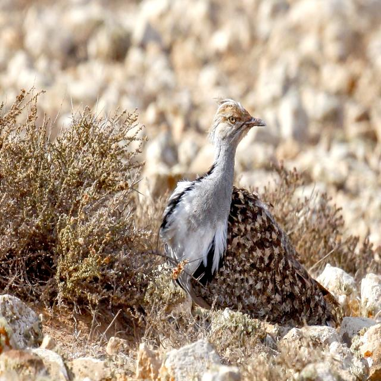 | 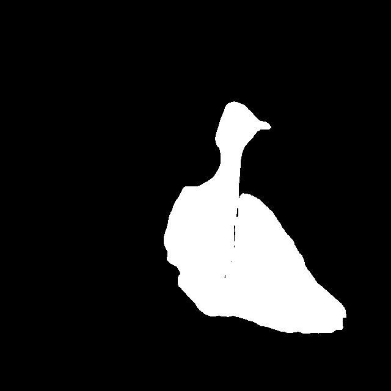 | 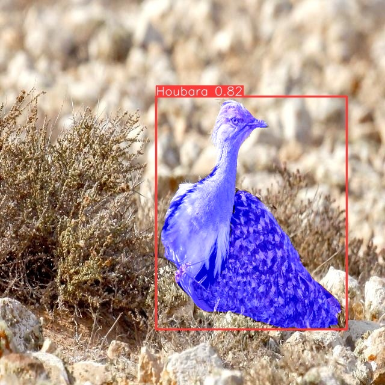 |
| 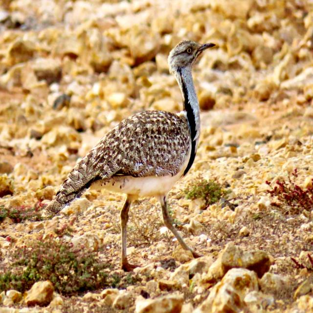 | 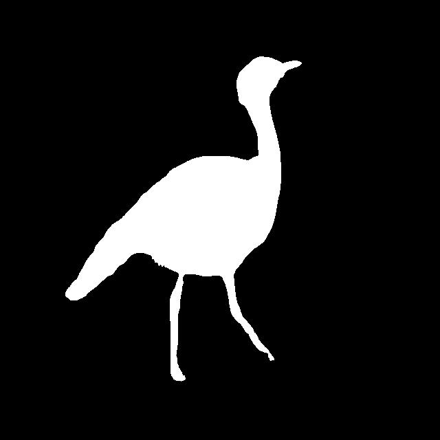 | 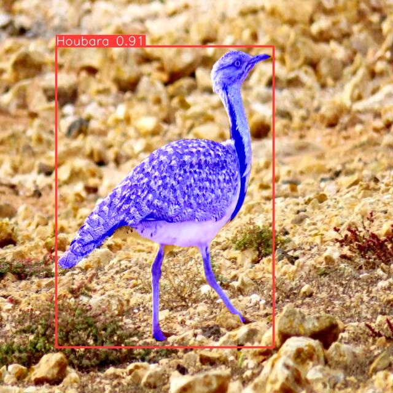 |
| 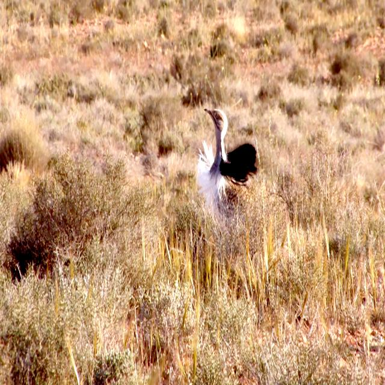 |  | 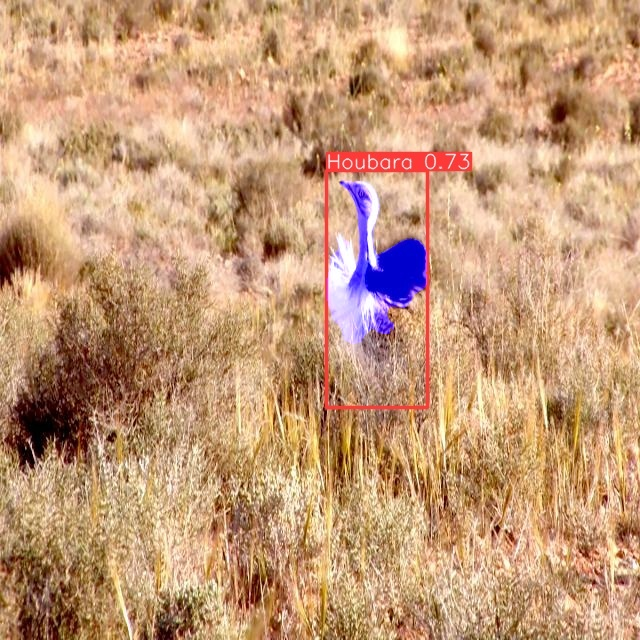 |
| 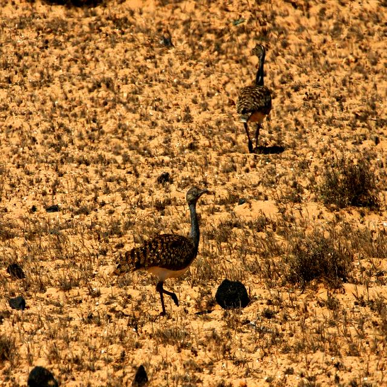 | 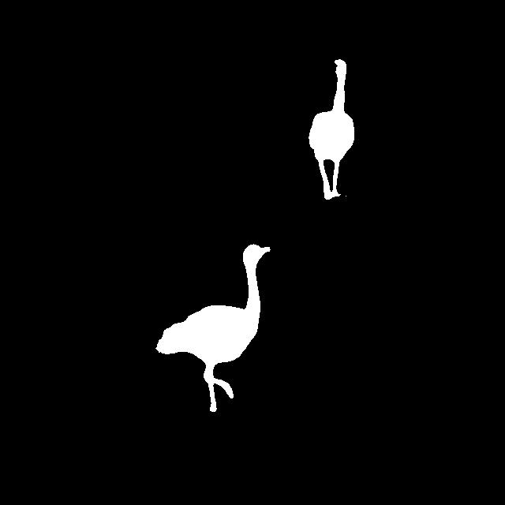 | 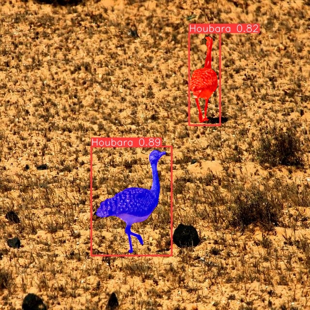 |


---

## 🔍 Example Script (`detect.py`)

```python
import os
import cv2
from ultralytics import YOLO, SAM

# Load Models
yolo_model = YOLO("models/best_yolo10_40k.pt")
sam_model = SAM("models/mobile_sam.pt")

# Define Input/Output Folders
input_folder = "input_images/"
output_folder = "output/"
os.makedirs(output_folder, exist_ok=True)

# Process Images
for img_name in os.listdir(input_folder):
    img_path = os.path.join(input_folder, img_name)
    img = cv2.imread(img_path)
    
    # Run YOLO Detection
    results = yolo_model.predict(img_path, conf=0.7)
    
    # Run SAM Segmentation
    for result in results:
        mask = sam_model.predict(img, result.boxes.xyxy.tolist())
        
        # Save Mask
        mask_path = os.path.join(output_folder, f"mask_{img_name}")
        cv2.imwrite(mask_path, mask)

print("✅ Processing Complete!")
```

---

## 📜 **Acknowledgments**
This project is developed for **wildlife conservation and AI research**.  
If you use this work, please consider citing our research.

---

## 🤝 Contributing
Pull requests and contributions are welcome!  

---

## 📌 Real-Time Threaded Houbara Detection and Segmentation for Wildlife Conservation Using Mobile Platforms
🔥 Authors
Lyes Saad Saoud, Loïc Lesobre, Enrico Sorato, Yves Hingrat, Lakmal Seneviratne, Irfan Hussain*
---
## 🏛 Affiliations
1 Khalifa University Center for Autonomous Robotic Systems (KUCARS), Khalifa University, Abu Dhabi, United Arab Emirates.
2 RENECO International Wildlife Consultants LLC, Abu Dhabi, United Arab Emirates.
---
## 📖 Please Cite
If you find this work useful, please cite our research using the following BibTeX entry:

---
@article{SaadSaoud2025HoubaraDetection,
  author    = {Lyes Saad Saoud and Loïc Lesobre and Enrico Sorato and Yves Hingrat and Lakmal Seneviratne and Irfan Hussain},
  title     = {Real-Time Threaded Houbara Detection and Segmentation for Wildlife Conservation Using Mobile Platforms},
  journal   = {Preprint},
  year      = {2025},
  publisher = {arXiv},
  url       = {https://arxiv.org/abs/XXXX.XXXXX}
}
